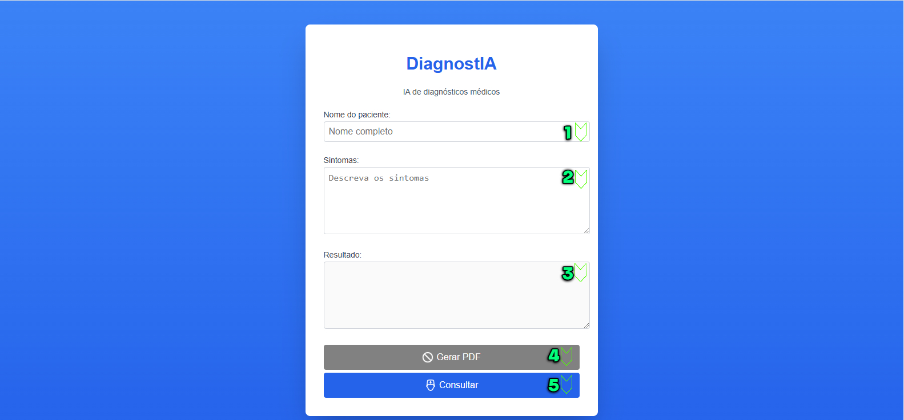

# Projeto Integrador IV
## DiagnostIA

### Tabela de Conteúdos
1. [Introdução](#introdução)
2. [Funcionalidades do Site](#funcionalidades-do-site)
3. [Código HTML](#código-html)
4. [Código CSS](#código-css)
5. [Código JavaScript](#código-javascript)
6. [Conclusões](#conclusões)

### Introdução
Este projeto tem como objetivo auxiliar médicos em seu trabalho, promovendo uma otimização no tempo de consulta e facilitando o diagnóstico.

### Funcionalidades do Site


1. Campo para inserir o nome do paciente.
2. Campo para a descrição dos sintomas apresentados pelo paciente.
3. Resultado das possíveis doenças ou problemas identificados pela IA.
4. Botão para gerar um PDF do documento (habilitado somente após clicar em "Consultar"). O PDF contém todos os dados coletados e gerados pela IA.
5. Botão "Consultar" para solicitar uma análise da IA (habilitado somente após os campos de nome e sintomas serem preenchidos). A IA gera possíveis diagnósticos com base nas informações fornecidas.

### Código HTML
O código HTML estabelece a estrutura básica para coleta de dados e os botões que acionam funções do JavaScript.

```html
<!-- Botões para solicitar resultado da IA e gerar PDF -->
<!-- Botões para solicitar resultado da IA e gerar PDF -->
<div class="box-button">
    <button type="button" class="pdf centralizar" onclick="GerarPDF()" disabled>
         Gerar PDF
    </button>
    <button type="button" class="consulta centralizar" onclick="chamarGroqAPI()">
         Consultar
    </button>
</div>
```
### Código CSS
O CSS define o design do projeto e inclui uma animação de carregamento exibida após clicar em "Consultar".
```css
/* Animação de carregamento (loader): */
.loader {
    animation: spin 2s linear infinite;
}
  
@keyframes spin {
    0% { transform: rotate(0deg); }
    100% { transform: rotate(360deg); }
}
```
### Código JS
O JavaScript controla a ativação dos estilos CSS, a comunicação com a IA para obtenção dos resultados, a geração de dados de hora/data e a criação do PDF.
```js
//Função que pega os sintoma(s) e faz a pergunta a IA
function requestBody(text) {
    return {
        "messages": [
            {
            "role": "user",
            "content": `Informe as top 3 possíveis doenças para os seguintes sintomas: ${text}, começe a resposta sempre com um 'Com base' e essa resposta tem que auxiliar o médico`
            }
        ],
        "model": "llama3-8b-8192"
    }
}
```
### Conclusões
Este projeto é uma solução simples, porém objetiva, desenvolvida para apoiar o trabalho dos profissionais da saúde no dia a dia. **Este site destina-se ao uso exclusivo de médicos e não deve ser utilizado por pacientes.**

